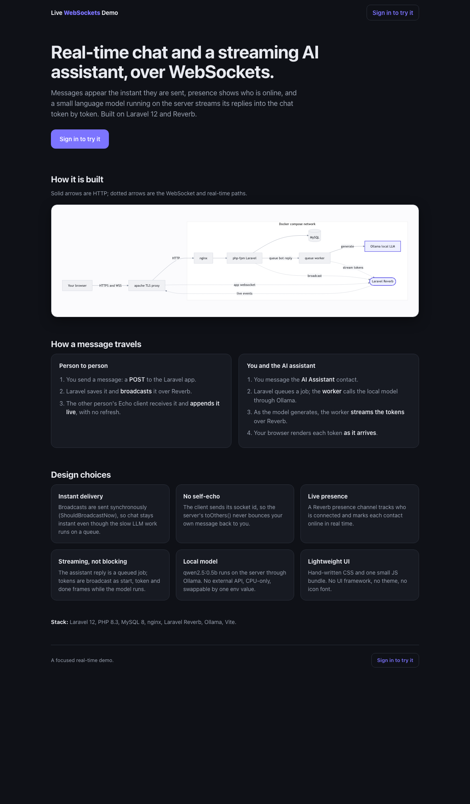
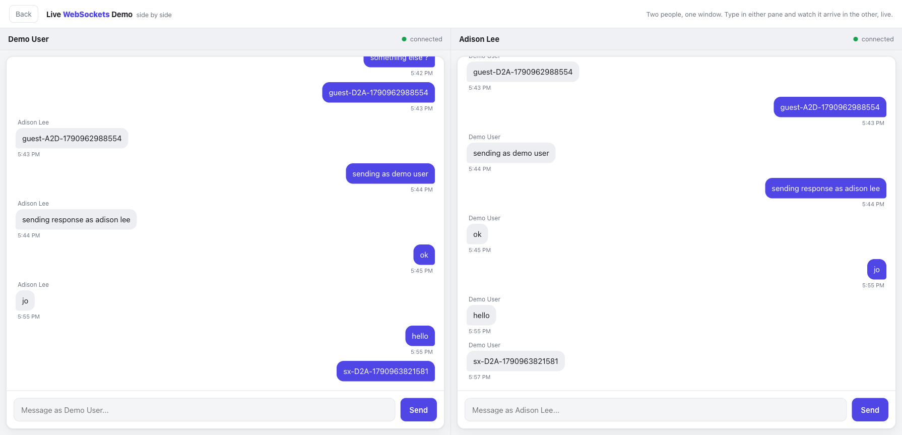
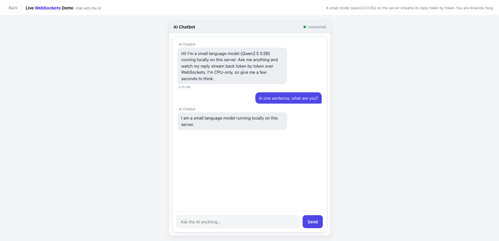
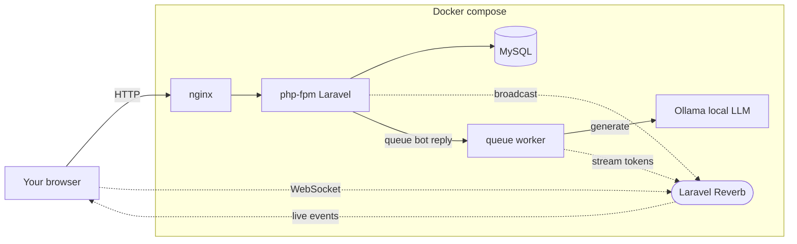

# Reverb Chat + LLM Demo

A small Laravel 12 app showing **real-time chat over Laravel Reverb (WebSockets)** with presence, and a **local LLM that streams its replies into the chat token by token**.

**Live demo: <https://websockets-demo.subdot.link>**. No sign-in needed to try it.



## Try it (three ways, two need no login)

- **See two people live** (`/split`): two chat panes in one window; type in either and it arrives in the other instantly.
- **Chat with the AI** (`/ai`): a small model (qwen2.5:0.5b via Ollama) streams its reply into the chat as it generates.
- **Sign in for the full app**: pick one of the seeded people and message anyone, including the AI.

Seeded logins (password `password`): `demo@example.com`, `adison@example.com`, `lisa@example.com`, `troy@example.com`, `sadi@example.com`, `amanda@example.com`.

| Side by side (`/split`) | Chat with the AI (`/ai`) |
| --- | --- |
|  |  |

## How it works



- You send a message over HTTP; Laravel stores it and broadcasts it over Reverb; other browsers receive it live, with no refresh.
- Messaging the AI queues a job; a worker runs the local model through Ollama and broadcasts the reply **as it streams**, in start / token / done frames.
- Broadcasts are sent synchronously (`ShouldBroadcastNow`) so chat stays instant even though the LLM work runs on a queue.

## Run it locally

```bash
composer install && npm install && npm run build   # run on the host
docker compose up -d
```

Then open <http://localhost:8091> and sign in with `demo@example.com` / `password`, or visit `/split` or `/ai` directly.

Tests:

```bash
docker compose exec php php artisan test   # PHPUnit route smoke
npm run test:e2e                           # Playwright: two-user live chat + presence
```

The first boot pulls the Ollama model (~400 MB) and runs migrations and seeders automatically.

## Stack

Laravel 12 · PHP 8.3 · MySQL 8 · nginx · Laravel Reverb · Ollama (qwen2.5:0.5b) · Vite with hand-written CSS. No UI framework, no theme.

## Notes

- The LLM is a 0.5B model running CPU-only, so replies are short and take a few seconds. The point is the live token streaming, not model quality. Change it with the `LLM_MODEL` env var (any Ollama tag).
- The `/split` and `/ai` pages use short-lived signed tokens so two identities (or a guest) can chat in one browser without separate sessions. That is a demo convenience, not a production auth pattern.

## Licence

MIT. See [LICENSE](LICENSE).
